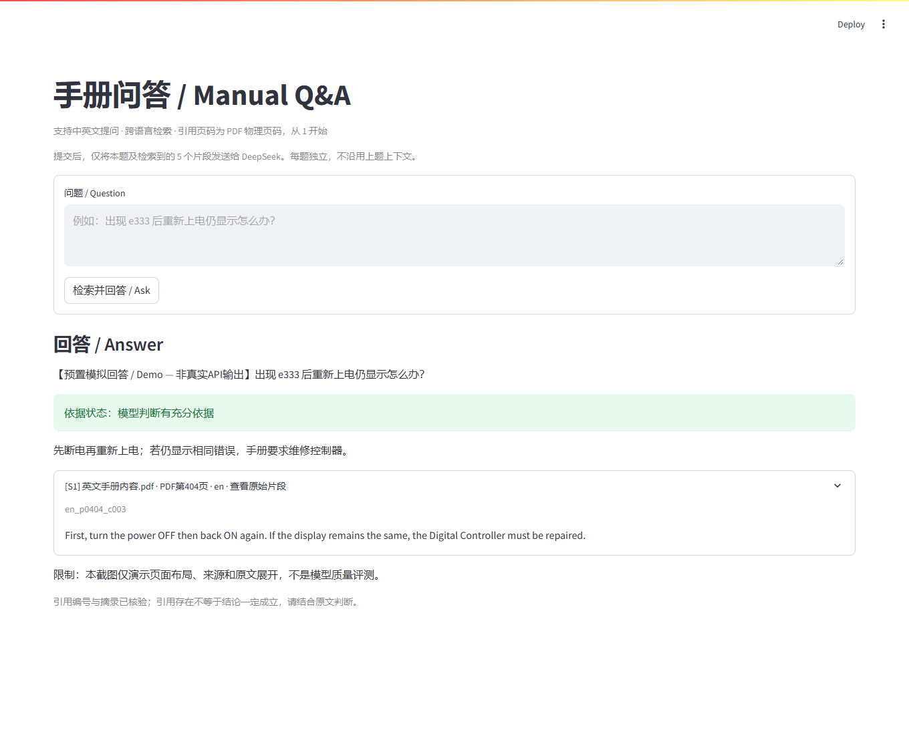
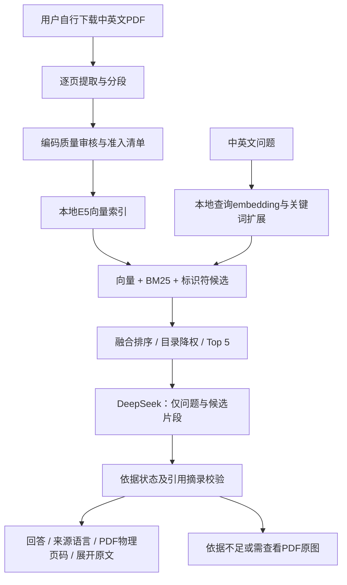

# 双语工业手册问答

基于 OMRON E5□C / E5@C 温控器手册的本地检索增强问答项目。支持中英文提问、跨语言召回、PDF物理页码引用及原文展开。文本提取、embedding与混合检索在本地运行；只有提交问答时，当前问题及Top 5片段发送给DeepSeek。



截图为真实Streamlit页面的**预置模拟回答展示**，未调用DeepSeek，不代表真实生成质量。截图复现方法见 `tools/capture_demo.py`。

## 能做什么

- PyMuPDF逐页抽取，约500–800字符分段，约100字符重叠，不跨PDF页；不自动OCR。
- 保守编码质量审核：本次1995条原始片段中1596条准入（中文276、英文1320），399条暂缓，原始数据不删除。
- 本地multilingual-e5-small，查询/文档标准前缀、512-token分窗、64-token重叠，不静默截断长片段。
- 向量、BM25、精确标识符混合召回，双语术语扩展；扩大候选后排序，目录降权，单页最多2条。
- 回答引用由索引元数据生成，检查来源ID及逐字摘录。依据不足时说明；接线关系不能从文字确认时要求查看PDF原图，不推断端子号。
- Streamlit缓存本地模型与索引，展开引用和页面重跑不会再次发起付费请求。

## 系统流程



## 手册来源与放置

手册版权属于OMRON。仓库**不提供PDF、抽取全文、索引或手册页面图片**。请从厂商官方渠道自行下载并遵守其使用条款：

| 语言 | 手册 | 官方入口 | 项目根目录文件名 |
|---|---|---|---|
| 中文 | E5□C 数字式控制器用户手册，H180 | [OMRON中文PDF](https://www.fa.omron.com.cn/data_pdf/mnu/h180-cn5-10_e5_c.pdf) | `中文手册内容.pdf` |
| 英文 | E5@C Digital Temperature Controllers User’s Manual，H174 | [OMRON英文PDF](https://files.omron.eu/downloads/latest/manual/en/h174_e5_c_-_digital_temperature_controllers_users_manual_en.pdf?v=1) | `英文手册内容.pdf` |

入口可能更新版本或要求登录；失效时在[OMRON手册下载页](https://www.omron.com.tw/products/family/3101/download/manual.html)搜索H180/H174。不要下载通信手册H181来替代。

本地评测文件分别424页、442页，可能是已去除封面的内容文件；原始下载URL与加工过程未留存，不能保证上面的现行下载文件与评测文件字节一致。**不要为凑页数盲目裁页**。页数、章节或哈希不同，必须重新审核页码、准入规则及评测。

评测输入SHA-256（不是密钥）：

```text
中文：b9c3a49015b9f14bc1d2526a4793c991cdb0f9b1255c11f54f7b541e1c74cded
英文：6706740e35b6841918837d9c3817cef1d12563b995331c83565d3f30cc91fd73
```

## 安装（Windows PowerShell）

建议Python 3.11或3.12。在克隆/下载后的仓库目录运行；首次安装依赖、下载模型需要联网：

```powershell
python -m venv .venv-retrieval
.\.venv-retrieval\Scripts\python.exe -m pip install --upgrade pip
.\.venv-retrieval\Scripts\python.exe -m pip install -r requirements.txt -r requirements-app.txt
.\.venv-retrieval\Scripts\python.exe download_embedding_model.py
```

支持CPU；CUDA加速取决于本机PyTorch、驱动与GPU。已验证环境为Windows、Python本地虚拟环境、PyTorch 2.8.0+cu126、Transformers 4.57.6、Streamlit 1.45.1。模型固定到提交 `614241f622f53c4eeff9890bdc4f31cfecc418b3`，保存在被忽略的 `models/`。

## 构建本地索引

确认两份PDF已放在根目录，再按顺序执行：

```powershell
$env:PYTHONIOENCODING = 'utf-8'
.\.venv-retrieval\Scripts\python.exe check_pdf.py
.\.venv-retrieval\Scripts\python.exe build_chunks.py
.\.venv-retrieval\Scripts\python.exe audit_chunks.py
.\.venv-retrieval\Scripts\python.exe local_vector_index.py build
.\.venv-retrieval\Scripts\python.exe local_vector_index.py evaluate
.\.venv-retrieval\Scripts\python.exe hybrid_retrieval.py evaluate
.\.venv-retrieval\Scripts\python.exe verify_vector_index.py
```

`audit_chunks.py`包含这两份特定手册的字体规则、页面视觉复核记录；`eligible_chunks()`目前明确校验1596条准入数量。这不是任意PDF通用的无监督审核工具。版本不匹配时应停下来重新复核，不能只删掉数量断言或复用旧页码标注。

`output/`存放生成数据，全部忽略。`output/vector_index_hybrid/`是网页使用的修正前缀派生索引。生成评测报告还可运行：

```powershell
.\.venv-retrieval\Scripts\python.exe report_retrieval.py
.\.venv-retrieval\Scripts\python.exe report_hybrid.py
.\.venv-retrieval\Scripts\python.exe verify_hybrid.py
```

评判JSON绑定原结果哈希；不同硬件或数据重建可能使哈希变化。此时报告会拒绝套用旧判断，需要重新阅读Top 5并更新评判，不能仅替换哈希。网页问答本身不依赖评测报告生成成功。

## 设置Key并启动网页

Key仅从服务进程的 `DEEPSEEK_API_KEY` 读取。以下方法避免将真实Key作为命令文本留在PowerShell历史中；请在**同一个终端**设置并启动：

```powershell
$secret = Read-Host '请输入 DeepSeek API Key' -AsSecureString
$credential = New-Object System.Management.Automation.PSCredential('deepseek', $secret)
$env:DEEPSEEK_API_KEY = $credential.GetNetworkCredential().Password
Remove-Variable secret, credential
.\.venv-retrieval\Scripts\python.exe -m streamlit run .\app.py --server.address 127.0.0.1 --server.port 8501 --browser.gatherUsageStats false --server.fileWatcherType none
```

打开 **http://127.0.0.1:8501**，按Ctrl+C停止。Key不放网页输入框、不存入仓库或会话缓存、不输出到日志。该进程环境变量包含明文凭据，仅在本机使用，勿打印整个环境。可在停止服务后用 `Remove-Item Env:DEEPSEEK_API_KEY` 清除本终端变量。

默认使用 `deepseek-flash`，请求格式依据[DeepSeek官方文档](https://api-docs.deepseek.com/zh-cn/)。调用可能产生费用；凭据与账户可用性需由用户在本机确认。CLI入口及更多选项见 [README_deepseek.md](README_deepseek.md)。

## 评测结果与限制

固定20题：中英文各10题；参数设置、报警、接线、故障排查各5题。判断对象是**本题Top 5是否提供充分检索依据**，不是DeepSeek最终回答。

| 判定 | 原纯向量检索 | 混合检索 |
|---|---:|---:|
| 检索依据充分 | 9 | **15** |
| 部分充分 | 2 | **4** |
| 未找到 | 9 | **1** |

**15/20 = 75%是这20题的充分依据比例，不是最终回答准确率，也不是全库召回率。** 排序和词表调整参考了这些问题，因此它是开发集复测，不是独立测试集。未进行真实DeepSeek答案质量评测。

Q01召回英文155页直接依据，Q06中文175页与Q18英文404页目标均升至第1。Q07退步为部分；Q08仍缺完整依据。Q12/Q15保留看图提示；Q11新召回明确型号对应文字。逐题摘要见 [docs/evaluation.md](docs/evaluation.md)，机器可读摘要见 [docs/evaluation_summary.json](docs/evaluation_summary.json)。题目及原判定标准保留在 `retrieval_questions.json`。

引用校验只能确认来源和摘录存在，不能保证结论正确。长片段聚合会稀释细节；目录检测是启发式；不执行OCR，也不从线性文字重建接线图。

## 验证与仓库检查

```powershell
.\.venv-retrieval\Scripts\python.exe -m unittest test_app.py test_ask_deepseek.py
.\.venv-retrieval\Scripts\python.exe tools/audit_repository.py
```

7项离线测试覆盖页面中英文提问、缓存复用、引用展开、缺Key/错误处理及API模拟。测试使用虚构凭据，不调用远程API。真实Streamlit首页与健康端点已验证HTTP 200；这不证明远程账号或回答质量。

仓库扫描器检查拟提交文件以及存在时可读取的本地Git对象（含不可达对象）和reflog，不打印匹配内容。它结合Key格式与当前环境凭据精确匹配，不能保证检测所有秘密；不能扫描尚未获取的远程历史。发现真实凭据应先撤销/轮换，再处理历史，`.gitignore`不能清除已提交秘密。

拟提交清单见 [docs/proposed_files.txt](docs/proposed_files.txt)，本次检查记录见 [docs/repository_audit.json](docs/repository_audit.json)。本次整理不自动提交或推送。
